# How do I run the program?

1. Open the Terminal application

   a. This can be easily done from Spotlight in the top right of your computer. Click this search icon and type "Terminal"
   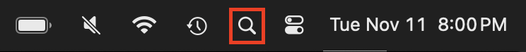

2. With the Terminal open, navigate to the octomino folder

   a. Type `cd octomino` and press Enter

3. Start the local web server

   a. Type `npm run dev` and press Enter

   b. You should see something similar to the below picture

   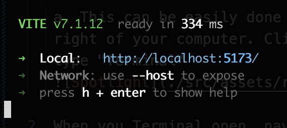

4. Keep the Terminal open on the above screen, and open a web browser (Chrome) to `http://localhost:5173/`. The game should be visible!

# How do I stop the local web server?

1. If you have a Terminal open and see the below image, that means the local web server is running

To stop the web server, click in the Terminal window and hit `Control-C`. Note this is different from `Command-C`!

# How do I get the latest changes to the code?

**NOTE**: it will be easiest to do this if you have no local changes! (See the local changes section below)

1. Open Visual Studio Code (VS Code)

   a. If it's not in your Applications folder, it might be in your Downloads folder

   b. You can use Spotlight to help find it as well

2. VS Code might already open to the Octomino folder. You will know because the top of the application says "Octomino"

   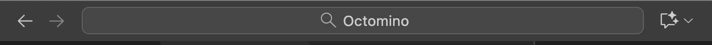

   a. If the Octomino folder isn't open by default, go to the top left of your computer, File -> Open Folder, and find the Octomino folder

   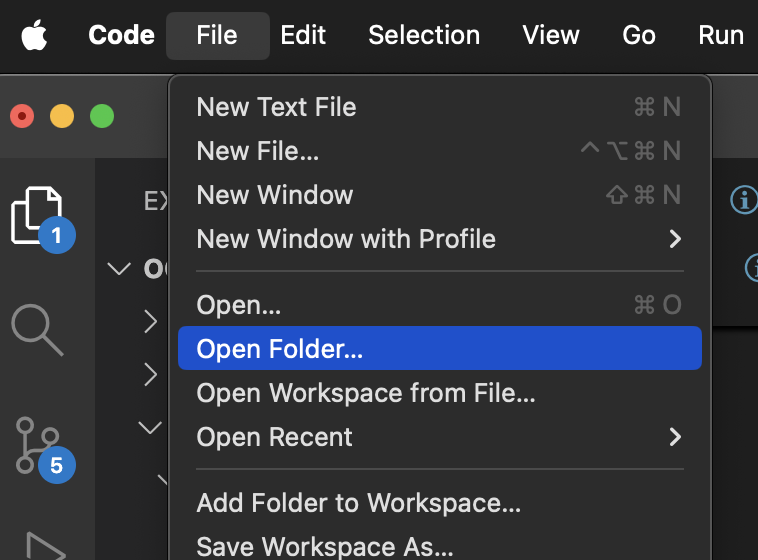

3. In the vertical left sidebar click the Source Control tab

   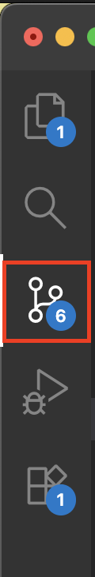

4. Make sure the Graph tab is visible (see picture in Step 5). It might be collapsed at the bottom of the screen

5. There are two buttons highlighted in the picture below. Click the left button first, then click the right button. Wait a few seconds between clicking the buttons, you should see blue loading bars in the UI

   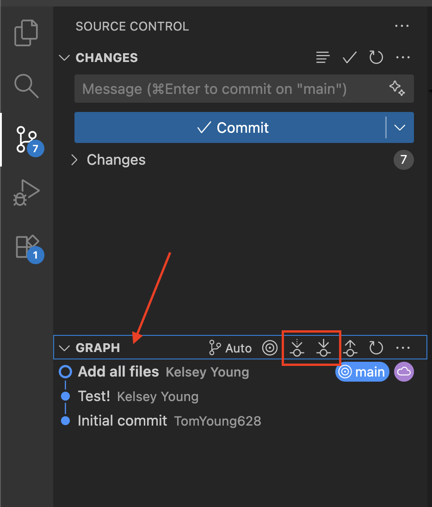

# How do I make changes to the code locally?

1. Open VS Code to the Octomino folder as described above

2. Make code changes in files!

3. `Command-S` will save the file

4. To see what files you've changed, click the Source Control tab. You should see a list of files changed under Changes

   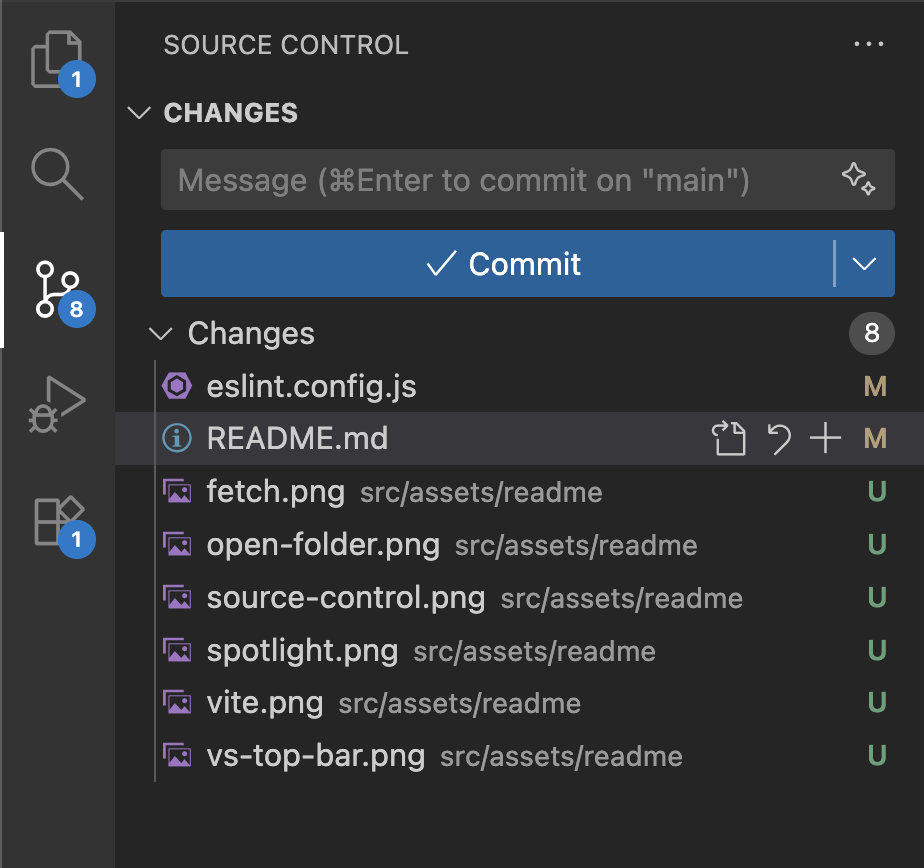

   a. If you click on a file here it will show a "comparison view" of what lines you've changed

   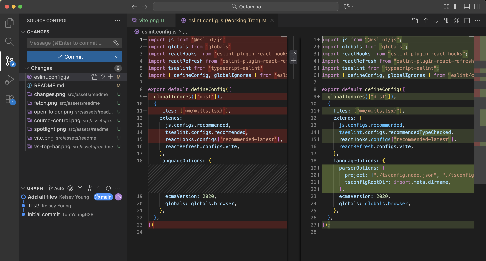

# How do I get rid of all my local changes?

1. Go to the Source Control tab

2. Right click the changes header and click "Discard All Changes"

   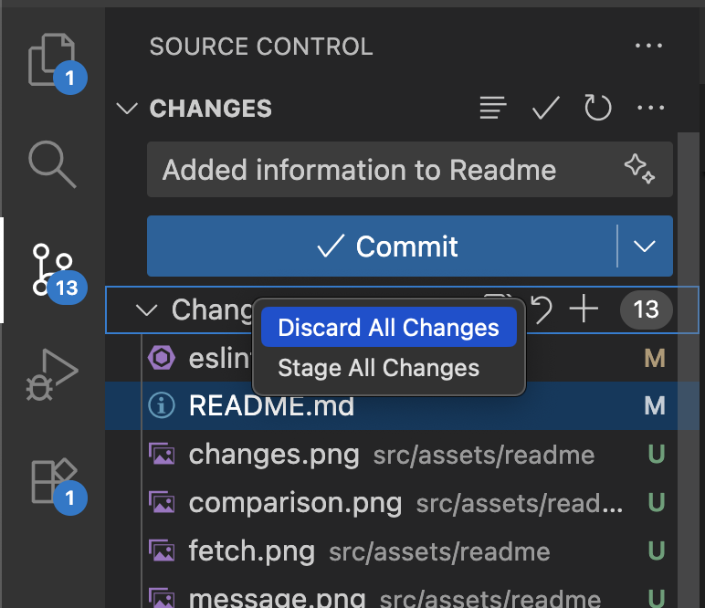

# How do I send my local changes to Github?

1. When all of your local changes in the Source Control tab look good, you need to do two things. 1) Commit your code, and 2) push your commits to Github

## How to commit your code

1. In the Source Control tab, add a Commit message at the top

   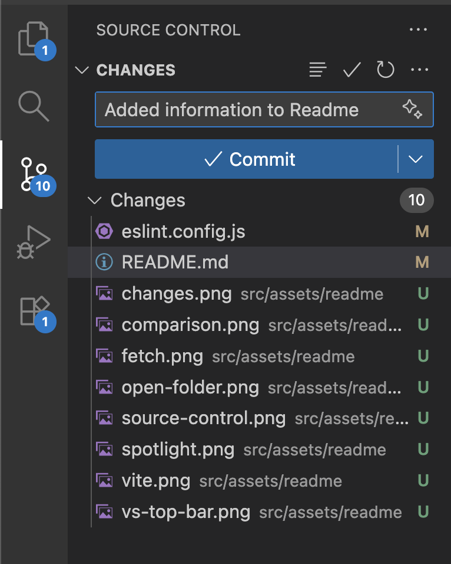

2. Right click the Changes header and click "Stage All Changes"

   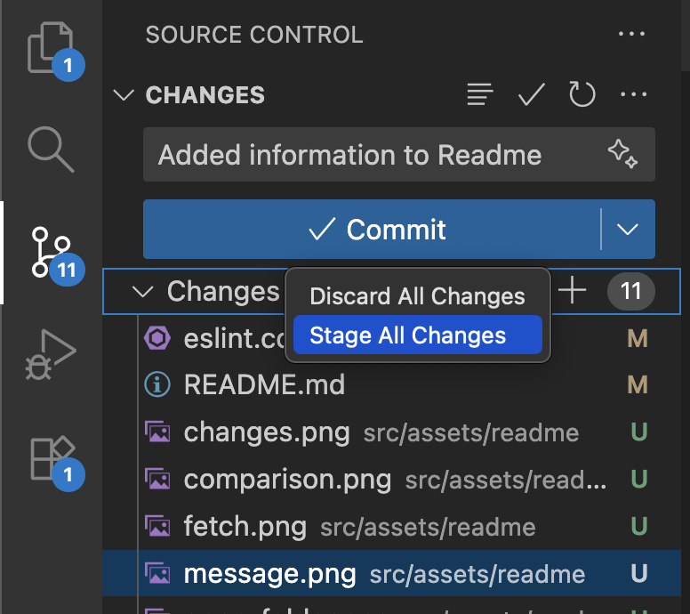

3. Click the blue Commit button

## How to push your commits to Github

1. In the Graph header in the Source Control tab, click the below highlighted button

   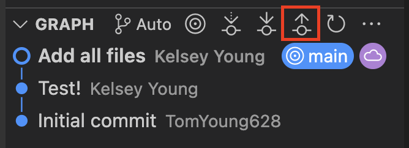
